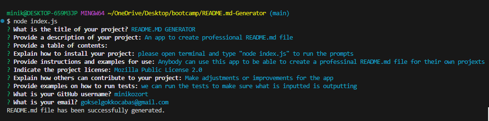

Title: 
README.MD-GENERATOR

Description:
In this challenge, I have created an app to be run at the terminal to create a professional README.md file. User can simply answer promted questions and be able to create their own README.md file with this application without any hassle.
How to Run:
Open terminal in vscode, please download and install necessary packages first. To install - type in "npm install" and press enter - this will install the necessary packages that are needed to run the app. Then type in "node index.js" and press enter, user will be prompted a series of questions that they want to answer to be writted to their created README.md file. Once, user answers all the questions, the README.md file will be created with the link to the license user has chosen and professional looking README file to be used for any project. The table of contents links will take you to the appropriate section of the read me file. The email link will prompt an email to be sent to the creator for more questions as well as the link for the git hub user will take you to their git hub pages.

GitHub Repository: https://github.com/minikozort/README.md-Generator.git

Google Video: https://drive.google.com/file/d/1c1WenctUZBhznzQBcCtb30rxV9bHoyQt/view?usp=sharing

